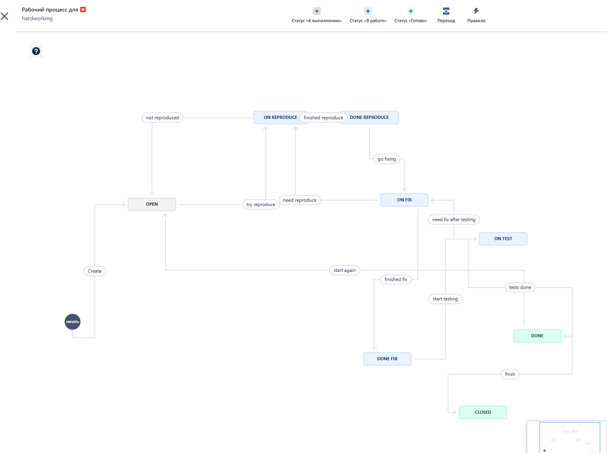

# Домашнее задание к занятию 7 «Жизненный цикл ПО»

Jira довольно серьезно изменили дизайн и интерфейс с момента записи лекции. Например, теперь нельзя на сайте создать скрам доску рядом с канбан-доской. Теперь после создания канбан-доски нужно активировать беклог и спринты, и соответственно из раздела "беклог" создавать спринты и доски спринтов. 

## Флоу для bug

## Флоу для task

## Экспорт workflow
В общих настройках в соответствии с мануалом  флоу и типы задач из проекта не тянутся. Предлагается их явно создать и по новой настроить, чтобы потом экспортировать. Так что выгрузить не вышло.

А в самом проекте показываются (см. скрины выше), но экспорта в XML там нет.
