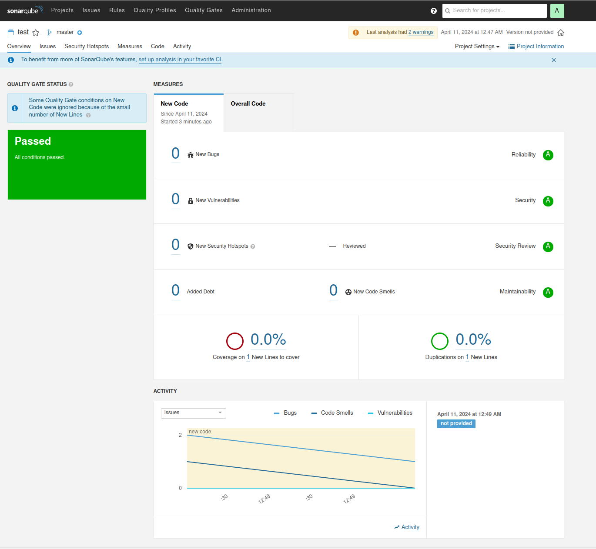

# Домашнее задание 9 «Процессы CI/CD»

## Подготовка к выполнению

Созданы 2 ВМ, при установке из плейбука возникла проблема с 11 версией постгреса (пришлось апдейтнуть на 12, так как 11 пропала из репозитория). Все остальное поставилось.

## Знакомоство с SonarQube



## Знакомство с Nexus

В репозиторий `maven-public` загрузите артефакт 

[maven-metadata.xml](maven-metadata.xml)

### Знакомство с Maven

Проверьте `mvn --version`.

```
Apache Maven 3.9.6 (bc0240f3c744dd6b6ec2920b3cd08dcc295161ae)
Maven home: /opt/apache-maven-3.9.6
Java version: 11.0.22, vendor: Ubuntu, runtime: /usr/lib/jvm/java-11-openjdk-amd64
Default locale: ru_RU, platform encoding: UTF-8
OS name: "linux", version: "6.5.0-14-generic", arch: "amd64", family: "unix"
```

В ответе пришлите исправленный файл `pom.xml`.

[pom.xml](mvn/pom.xml)
