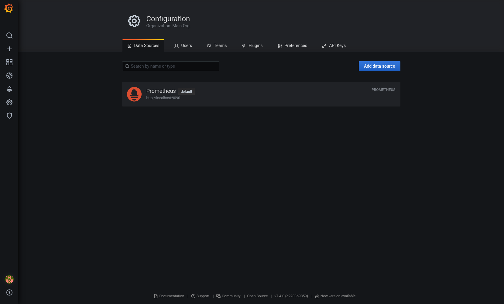
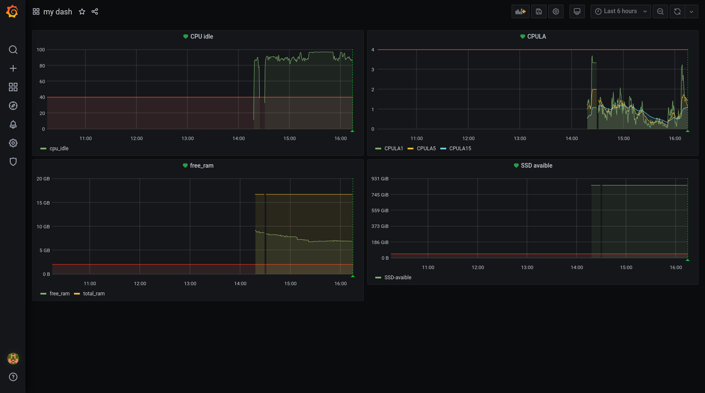
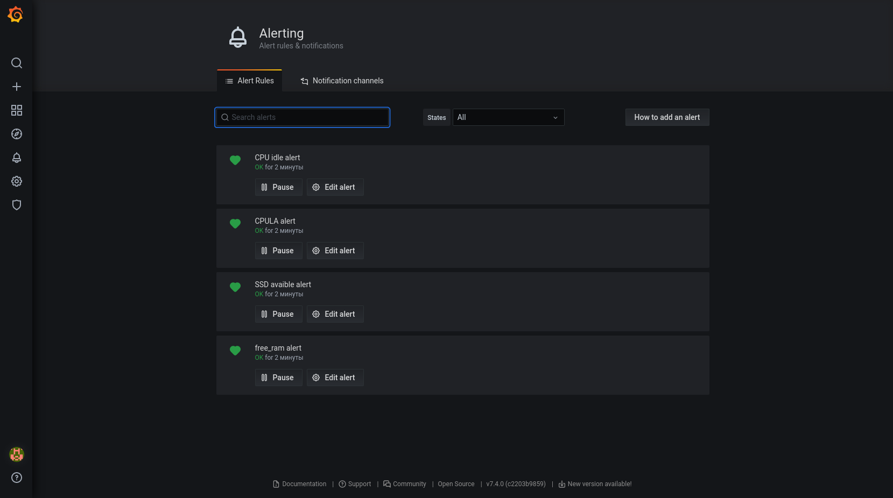

# Домашнее задание к занятию «Средство визуализации Grafana»

### Задание 1

1. Используя директорию [help](./help) внутри этого домашнего задания, запустите связку prometheus-grafana.
2. Зайдите в веб-интерфейс grafana, используя авторизационные данные, указанные в манифесте docker-compose.
3. Подключите поднятый вами prometheus, как источник данных.
4. Решение домашнего задания — скриншот веб-интерфейса grafana со списком подключенных Datasource.

## Задание 2

Изучите самостоятельно ресурсы:

1. [PromQL tutorial for beginners and humans](https://valyala.medium.com/promql-tutorial-for-beginners-9ab455142085).
1. [Understanding Machine CPU usage](https://www.robustperception.io/understanding-machine-cpu-usage).
1. [Introduction to PromQL, the Prometheus query language](https://grafana.com/blog/2020/02/04/introduction-to-promql-the-prometheus-query-language/).

Создайте Dashboard и в ней создайте Panels:

- утилизация CPU для nodeexporter (в процентах, 100-idle);
`avg(rate(node_cpu_seconds_total{mode="idle"}[1m])*100)`
- CPULA 1/5/15;
`node_load1/node_load5/node_load15`
- количество свободной оперативной памяти;
`node_memory_MemFree_bytes`
- количество места на файловой системе.
`node_filesystem_avail_bytes{mountpoint="/", device="/dev/nvme0n1p2"}`

Для решения этого задания приведите promql-запросы для выдачи этих метрик, а также скриншот получившейся Dashboard.

## Задание 3

1. Создайте для каждой Dashboard подходящее правило alert — можно обратиться к первой лекции в блоке «Мониторинг».
1. В качестве решения задания приведите скриншот вашей итоговой Dashboard.

## Задание 4

1. Сохраните ваш Dashboard.Для этого перейдите в настройки Dashboard, выберите в боковом меню «JSON MODEL». Далее скопируйте отображаемое json-содержимое в отдельный файл и сохраните его.
1. В качестве решения задания приведите листинг этого файла.
[model.json](model.json)
---

