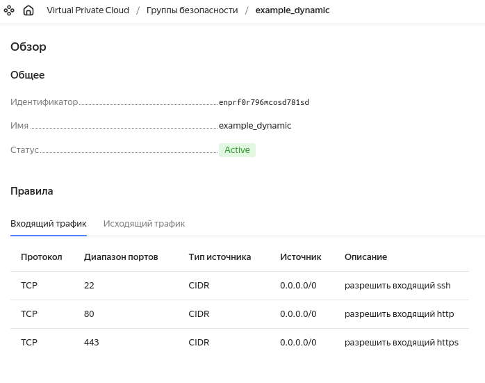
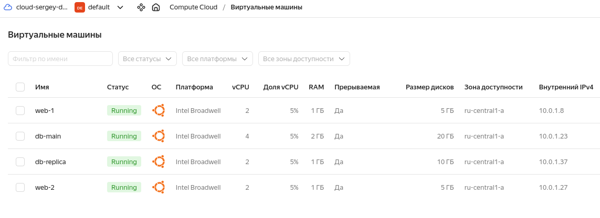
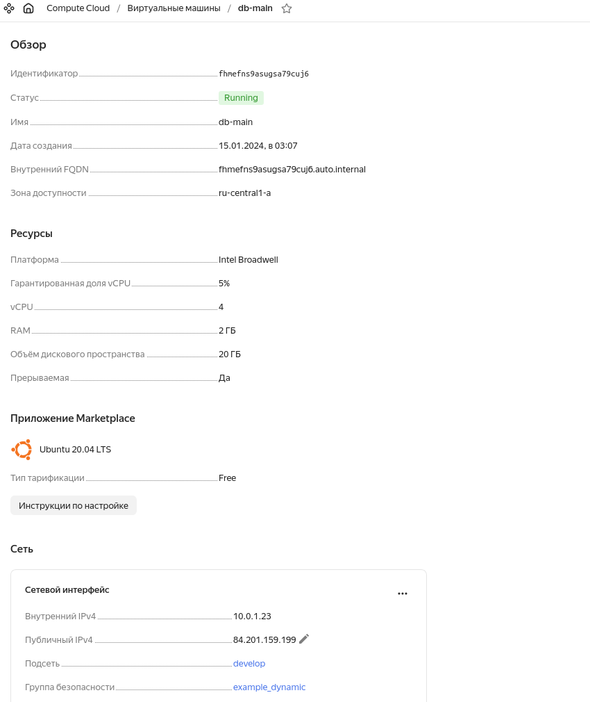

# Задача 1


# Задача 2


Из скриншота видно, что группа безопасности применена.

[count-vm.tf](count-vm.tf)

[for_each-vm.tf](for_each-vm.tf)

# Задача 3
Диски размером меньше 1 ГБ не дает создать, только от 5 Гб.

[disk_vm.tf ](disk_vm.tf)

# Задача 4
```
[webservers]
web-1   ansible_host=51.250.1.29  fqdn=fhm5d84niejil9eh5mbs.auto.internal
web-2   ansible_host=51.250.8.158  fqdn=fhmqgkp5ono96ke9qgt7.auto.internal

[databases]
db-main   ansible_host=84.201.159.199 fqdn=fhmefns9asugsa79cuj6.auto.internal
db-replica   ansible_host=51.250.89.23 fqdn=fhmn4mqgp78lt7q15iqm.auto.internal

[storage]
storage   ansible_host=84.201.173.10  fqdn=fhmuc96ib8dulr6a0n2o.auto.internal
```
[ansible.tf](ansible.tf)
[hosts.tftpl](hosts.tftpl)


# Задача 5*

[outputs.tf](outputs.tf)

```
Outputs:

vms = [
  {
    "fqdn" = "fhm5d84niejil9eh5mbs.auto.internal"
    "id" = "fhm5d84niejil9eh5mbs"
    "name" = "web-1"
  },
  {
    "fqdn" = "fhmqgkp5ono96ke9qgt7.auto.internal"
    "id" = "fhmqgkp5ono96ke9qgt7"
    "name" = "web-2"
  },
  {
    "fqdn" = "fhmefns9asugsa79cuj6.auto.internal"
    "id" = "fhmefns9asugsa79cuj6"
    "name" = "db-main"
  },
  {
    "fqdn" = "fhmn4mqgp78lt7q15iqm.auto.internal"
    "id" = "fhmn4mqgp78lt7q15iqm"
    "name" = "db-replica"
  },
  {
    "fqdn" = "fhmuc96ib8dulr6a0n2o.auto.internal"
    "id" = "fhmuc96ib8dulr6a0n2o"
    "name" = "storage"
  },
]
```