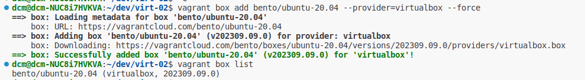
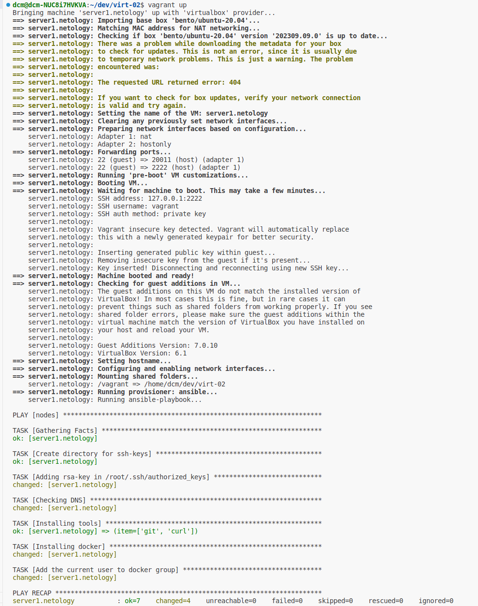
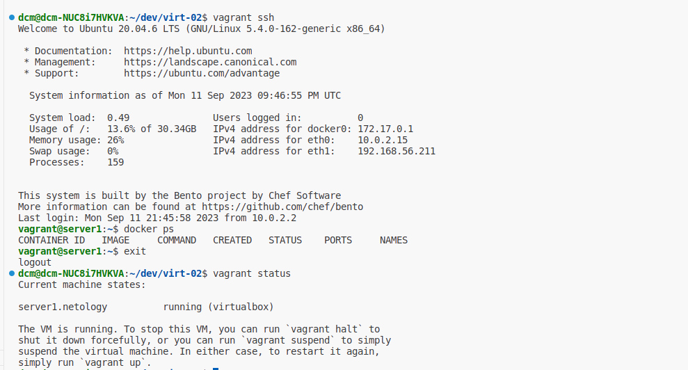

# Задача 1

## Опишите основные преимущества применения на практике IaaC-паттернов.
- быстрее конфигурировать инфраструктуру, а значит продукт быстрее попадет на рынок;
- меньше затрат на инфраструктуру, можно гибко использовать ресурсы (например, освобождать их ночью)
- стандартизация инфраструктуры, конфигурации меньше отличаются друг от друга;
- более безопасное развертывание по сравнению с ручным (программа меньше ошибается);
- хорошая масштабируемость;
- дополнительная документация того, как создана инфраструктура;
- удобное восстановление при сбоях.

## Какой из принципов IaaC является основополагающим?

Идемпотентность — при повторном выполнении мы получаем идентичный результат 

# Задача 2

## Чем Ansible выгодно отличается от других систем управление конфигурациями?
Для использования Ansible не требуется установка агентов в целевые системы, он работает через SSH. В целом это довольно простой (по сравнению с аналогами) инструмент с декларативным описанием конфигураций и возможностью подключения ролей и модулей.

## Какой, на ваш взгляд, метод работы систем конфигурации более надёжный — push или pull?
У обоих методов есть свои плюсы и минусы. Pull лучше подойдет для регулярного автоматического обновления системных компонентов на большом количестве серверов. Push - гораздо удобней при выкладке приложений, поскольку его можно инициировать в нужный момент. Если под надежностью мы понимаем гарантированность выкладки ПО, то нужно использовать push-метод, он позволит в процессе пайплайна убедиться, что выкладка удалась.

# Задача 3

Установите на личный компьютер:
### VirtualBox
> VBoxManage -version\
6.1.38_Ubuntur153438

### Vagrant
> vagrant -v\
Vagrant 2.2.19

### Terraform
> terraform --version\
Terraform v1.6.0-beta1\
on linux_amd64

### Ansible
> ansible --version\
ansible 2.10.8\
  config file = None\
  configured module search path = ['/home/dcm/.ansible/plugins/modules', '/usr/share/ansible/plugins/modules']\
  ansible python module location = /usr/lib/python3/dist-packages/ansible\
  executable location = /usr/bin/ansible\
  python version = 3.10.12 (main, Jun 11 2023, 05:26:28) [GCC 11.4.0]

# Задача 4
### Качаем образ (пришлось включить VPN через Германию)

### Настраиваем VM

### Проверяем, что внутри VM есть docker
