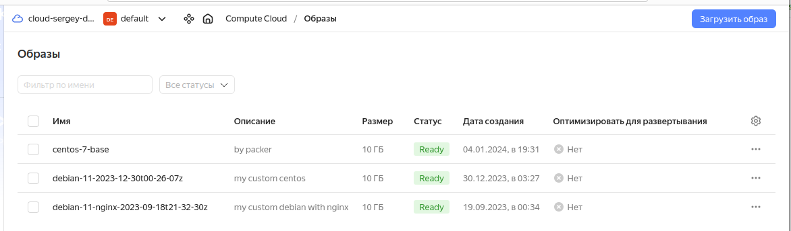
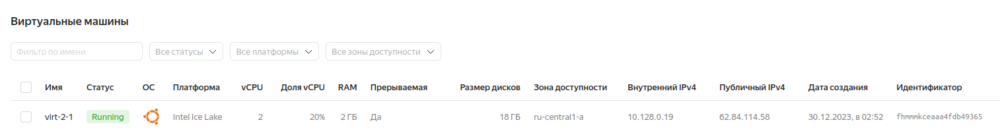
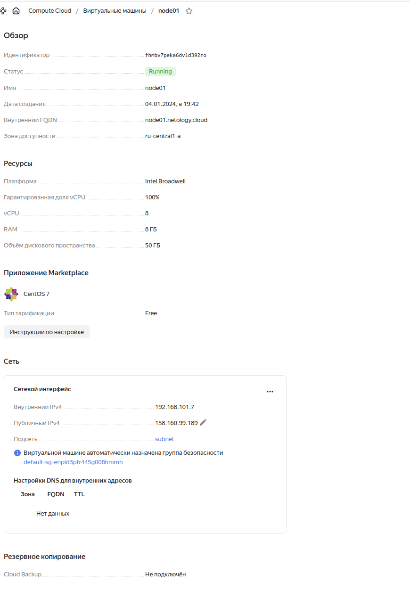
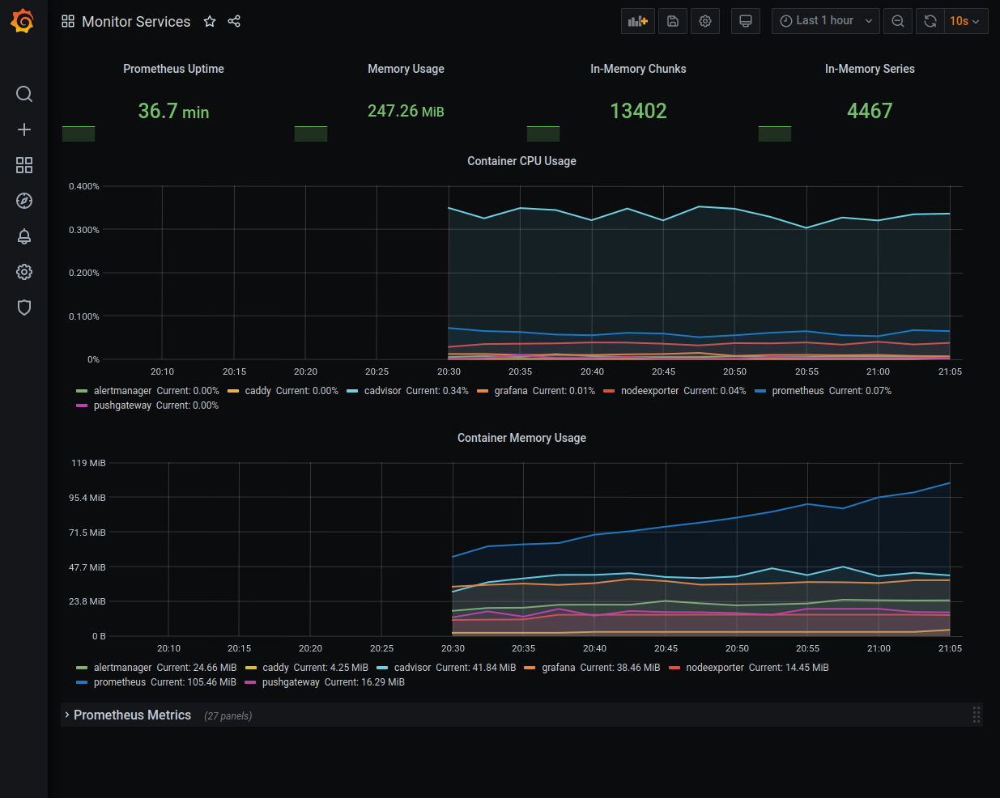

# Задача 1
```
packer init config.pkr.hcl 

packer validate debian-packer.json 
The configuration is valid.

packer build debian-packer.json 
yandex: output will be in this color.

==> yandex: Creating temporary RSA SSH key for instance...
==> yandex: Using as source image: fd8so0tbe3uu3harfgrs (name: "debian-11-v20231225", family: "debian-11")
==> yandex: Use provided subnet id e9b5f99fceaipur1og14
==> yandex: Creating disk...
==> yandex: Creating instance...
==> yandex: Waiting for instance with id fhmfes6rf0i4trqnpgcc to become active...
    yandex: Detected instance IP: 51.250.64.191
==> yandex: Using SSH communicator to connect: 51.250.64.191
==> yandex: Waiting for SSH to become available...
==> yandex: Connected to SSH!
==> yandex: Stopping instance...
==> yandex: Deleting instance...
    yandex: Instance has been deleted!
==> yandex: Creating image: debian-11-2023-12-30t00-26-07z
==> yandex: Waiting for image to complete...
==> yandex: Success image create...
==> yandex: Destroying boot disk...
    yandex: Disk has been deleted!
Build 'yandex' finished after 2 minutes 25 seconds.

==> Wait completed after 2 minutes 25 seconds

==> Builds finished. The artifacts of successful builds are:
--> yandex: A disk image was created: debian-11-2023-12-30t00-26-07z (id: fd8iq0dcnbmi2p05oi2q) with family name debian-server


packer build centos-packer.json

yandex: output will be in this color.

==> yandex: Creating temporary RSA SSH key for instance...
==> yandex: Using as source image: fd8i5298136bt9mrprke (name: "centos-7-v20240101", family: "centos-7")
==> yandex: Use provided subnet id e9b5f99fceaipur1og14
==> yandex: Creating disk...
==> yandex: Creating instance...
==> yandex: Waiting for instance with id fhm78detlu3dubgu7c91 to become active...
    yandex: Detected instance IP: 158.160.108.253
==> yandex: Using SSH communicator to connect: 158.160.108.253
==> yandex: Waiting for SSH to become available...
==> yandex: Connected to SSH!
==> yandex: Provisioning with shell script: /tmp/packer-shell2148622156
    yandex: Loaded plugins: fastestmirror
    yandex: Loading mirror speeds from cached hostfile
    yandex:  * base: mirror.sale-dedic.com
    yandex:  * extras: mirror.yandex.ru
    yandex:  * updates: centos-mirror.rbc.ru
    yandex: No packages marked for update
    yandex: Loaded plugins: fastestmirror
    yandex: Loading mirror speeds from cached hostfile
    yandex:  * base: mirror.sale-dedic.com
    yandex:  * extras: mirror.yandex.ru
    yandex:  * updates: centos-mirror.rbc.ru
    yandex: Package iptables-1.4.21-35.el7.x86_64 already installed and latest version
    yandex: Package curl-7.29.0-59.el7_9.2.x86_64 already installed and latest version
    yandex: Package net-tools-2.0-0.25.20131004git.el7.x86_64 already installed and latest version
    yandex: Package rsync-3.1.2-12.el7_9.x86_64 already installed and latest version
    yandex: Package openssh-server-7.4p1-23.el7_9.x86_64 already installed and latest version
    yandex: Resolving Dependencies
    yandex: --> Running transaction check
    yandex: ---> Package bind-utils.x86_64 32:9.11.4-26.P2.el7_9.15 will be installed
    yandex: --> Processing Dependency: bind-libs-lite(x86-64) = 32:9.11.4-26.P2.el7_9.15 for package: 32:bind-utils-9.11.4-26.P2.el7_9.15.x86_64
    yandex: --> Processing Dependency: bind-libs(x86-64) = 32:9.11.4-26.P2.el7_9.15 for package: 32:bind-utils-9.11.4-26.P2.el7_9.15.x86_64
    yandex: --> Processing Dependency: liblwres.so.160()(64bit) for package: 32:bind-utils-9.11.4-26.P2.el7_9.15.x86_64
    yandex: --> Processing Dependency: libisccfg.so.160()(64bit) for package: 32:bind-utils-9.11.4-26.P2.el7_9.15.x86_64
    yandex: --> Processing Dependency: libisc.so.169()(64bit) for package: 32:bind-utils-9.11.4-26.P2.el7_9.15.x86_64
    yandex: --> Processing Dependency: libirs.so.160()(64bit) for package: 32:bind-utils-9.11.4-26.P2.el7_9.15.x86_64
    yandex: --> Processing Dependency: libdns.so.1102()(64bit) for package: 32:bind-utils-9.11.4-26.P2.el7_9.15.x86_64
    yandex: --> Processing Dependency: libbind9.so.160()(64bit) for package: 32:bind-utils-9.11.4-26.P2.el7_9.15.x86_64
    yandex: --> Processing Dependency: libGeoIP.so.1()(64bit) for package: 32:bind-utils-9.11.4-26.P2.el7_9.15.x86_64
    yandex: ---> Package bridge-utils.x86_64 0:1.5-9.el7 will be installed
    yandex: ---> Package tcpdump.x86_64 14:4.9.2-4.el7_7.1 will be installed
    yandex: --> Processing Dependency: libpcap >= 14:1.5.3-10 for package: 14:tcpdump-4.9.2-4.el7_7.1.x86_64
    yandex: --> Processing Dependency: libpcap.so.1()(64bit) for package: 14:tcpdump-4.9.2-4.el7_7.1.x86_64
    yandex: ---> Package telnet.x86_64 1:0.17-66.el7 will be installed
    yandex: --> Running transaction check
    yandex: ---> Package GeoIP.x86_64 0:1.5.0-14.el7 will be installed
    yandex: --> Processing Dependency: geoipupdate for package: GeoIP-1.5.0-14.el7.x86_64
    yandex: ---> Package bind-libs.x86_64 32:9.11.4-26.P2.el7_9.15 will be installed
    yandex: --> Processing Dependency: bind-license = 32:9.11.4-26.P2.el7_9.15 for package: 32:bind-libs-9.11.4-26.P2.el7_9.15.x86_64
    yandex: ---> Package bind-libs-lite.x86_64 32:9.11.4-26.P2.el7_9.15 will be installed
    yandex: ---> Package libpcap.x86_64 14:1.5.3-13.el7_9 will be installed
    yandex: --> Running transaction check
    yandex: ---> Package bind-license.noarch 32:9.11.4-26.P2.el7_9.15 will be installed
    yandex: ---> Package geoipupdate.x86_64 0:2.5.0-2.el7 will be installed
    yandex: --> Finished Dependency Resolution
    yandex:
    yandex: Dependencies Resolved
    yandex:
    yandex: ================================================================================
    yandex:  Package            Arch       Version                        Repository   Size
    yandex: ================================================================================
    yandex: Installing:
    yandex:  bind-utils         x86_64     32:9.11.4-26.P2.el7_9.15       updates     262 k
    yandex:  bridge-utils       x86_64     1.5-9.el7                      base         32 k
    yandex:  tcpdump            x86_64     14:4.9.2-4.el7_7.1             base        422 k
    yandex:  telnet             x86_64     1:0.17-66.el7                  updates      64 k
    yandex: Installing for dependencies:
    yandex:  GeoIP              x86_64     1.5.0-14.el7                   base        1.5 M
    yandex:  bind-libs          x86_64     32:9.11.4-26.P2.el7_9.15       updates     158 k
    yandex:  bind-libs-lite     x86_64     32:9.11.4-26.P2.el7_9.15       updates     1.1 M
    yandex:  bind-license       noarch     32:9.11.4-26.P2.el7_9.15       updates      92 k
    yandex:  geoipupdate        x86_64     2.5.0-2.el7                    updates      35 k
    yandex:  libpcap            x86_64     14:1.5.3-13.el7_9              updates     139 k
    yandex:
    yandex: Transaction Summary
    yandex: ================================================================================
    yandex: Install  4 Packages (+6 Dependent packages)
    yandex:
    yandex: Total download size: 3.8 M
    yandex: Installed size: 9.0 M
    yandex: Downloading packages:
    yandex: --------------------------------------------------------------------------------
    yandex: Total                                               11 MB/s | 3.8 MB  00:00
    yandex: Running transaction check
    yandex: Running transaction test
    yandex: Transaction test succeeded
    yandex: Running transaction
    yandex:   Installing : 32:bind-license-9.11.4-26.P2.el7_9.15.noarch                1/10
    yandex:   Installing : geoipupdate-2.5.0-2.el7.x86_64                              2/10
    yandex:   Installing : GeoIP-1.5.0-14.el7.x86_64                                   3/10
    yandex:   Installing : 32:bind-libs-lite-9.11.4-26.P2.el7_9.15.x86_64              4/10
    yandex:   Installing : 32:bind-libs-9.11.4-26.P2.el7_9.15.x86_64                   5/10
    yandex:   Installing : 14:libpcap-1.5.3-13.el7_9.x86_64                            6/10
    yandex: pam_tally2: Error opening /var/log/tallylog for update: Permission denied
    yandex: pam_tally2: Authentication error
    yandex: useradd: failed to reset the tallylog entry of user "tcpdump"
    yandex:   Installing : 14:tcpdump-4.9.2-4.el7_7.1.x86_64                           7/10
    yandex:   Installing : 32:bind-utils-9.11.4-26.P2.el7_9.15.x86_64                  8/10
    yandex:   Installing : bridge-utils-1.5-9.el7.x86_64                               9/10
    yandex:   Installing : 1:telnet-0.17-66.el7.x86_64                                10/10
    yandex:   Verifying  : GeoIP-1.5.0-14.el7.x86_64                                   1/10
    yandex:   Verifying  : 14:libpcap-1.5.3-13.el7_9.x86_64                            2/10
    yandex:   Verifying  : 1:telnet-0.17-66.el7.x86_64                                 3/10
    yandex:   Verifying  : 32:bind-libs-9.11.4-26.P2.el7_9.15.x86_64                   4/10
    yandex:   Verifying  : geoipupdate-2.5.0-2.el7.x86_64                              5/10
    yandex:   Verifying  : 32:bind-libs-lite-9.11.4-26.P2.el7_9.15.x86_64              6/10
    yandex:   Verifying  : 32:bind-utils-9.11.4-26.P2.el7_9.15.x86_64                  7/10
    yandex:   Verifying  : 32:bind-license-9.11.4-26.P2.el7_9.15.noarch                8/10
    yandex:   Verifying  : 14:tcpdump-4.9.2-4.el7_7.1.x86_64                           9/10
    yandex:   Verifying  : bridge-utils-1.5-9.el7.x86_64                              10/10
    yandex:
    yandex: Installed:
    yandex:   bind-utils.x86_64 32:9.11.4-26.P2.el7_9.15   bridge-utils.x86_64 0:1.5-9.el7
    yandex:   tcpdump.x86_64 14:4.9.2-4.el7_7.1            telnet.x86_64 1:0.17-66.el7
    yandex:
    yandex: Dependency Installed:
    yandex:   GeoIP.x86_64 0:1.5.0-14.el7
    yandex:   bind-libs.x86_64 32:9.11.4-26.P2.el7_9.15
    yandex:   bind-libs-lite.x86_64 32:9.11.4-26.P2.el7_9.15
    yandex:   bind-license.noarch 32:9.11.4-26.P2.el7_9.15
    yandex:   geoipupdate.x86_64 0:2.5.0-2.el7
    yandex:   libpcap.x86_64 14:1.5.3-13.el7_9
    yandex:
    yandex: Complete!
==> yandex: Stopping instance...
==> yandex: Deleting instance...
    yandex: Instance has been deleted!
==> yandex: Creating image: centos-7-base
==> yandex: Waiting for image to complete...
==> yandex: Success image create...
==> yandex: Destroying boot disk...
    yandex: Disk has been deleted!
Build 'yandex' finished after 2 minutes 6 seconds.

==> Wait completed after 2 minutes 6 seconds

==> Builds finished. The artifacts of successful builds are:
--> yandex: A disk image was created: centos-7-base (id: fd8gql6apakmm8j2ek9m) with family name centos


yc compute image list
+----------------------+--------------------------------------+-------------------+----------------------+--------+
|          ID          |                 NAME                 |      FAMILY       |     PRODUCT IDS      | STATUS |
+----------------------+--------------------------------------+-------------------+----------------------+--------+
| fd8gql6apakmm8j2ek9m | centos-7-base                        | centos            | f2e6b3akkghducladcep | READY  |
| fd8iq0dcnbmi2p05oi2q | debian-11-2023-12-30t00-26-07z       | debian-server     | f2e6pu6ghavj23h6j866 | READY  |
| fd8qmpp31t0c1grf6e1f | debian-11-nginx-2023-09-18t21-32-30z | debian-web-server | f2e7gqht9nnm7j1n7g96 | READY  |
+----------------------+--------------------------------------+-------------------+----------------------+--------+


```


# Задача 2
## 2.1. Создано вручную


## 2.2. Создано с помощью терраформ
```
virt-04/terraform$ yc iam key create --service-account-name dcm-devops --output key.json

virt-04/terraform$ terraform plan
...
Plan: 3 to add, 0 to change, 0 to destroy.

Changes to Outputs:
  + external_ip_address_node01_yandex_cloud = (known after apply)
  + internal_ip_address_node01_yandex_cloud = (known after apply)


virt-04/terraform$ terraform apply

Terraform used the selected providers to generate the following execution plan. Resource actions are indicated with the following symbols:
  + create

Terraform will perform the following actions:

  # yandex_compute_instance.node01 will be created
  + resource "yandex_compute_instance" "node01" {
      + allow_stopping_for_update = true
      + created_at                = (known after apply)
      + folder_id                 = (known after apply)
      + fqdn                      = (known after apply)
      + gpu_cluster_id            = (known after apply)
      + hostname                  = "node01.netology.cloud"
      + id                        = (known after apply)
      + metadata                  = {
          + "ssh-keys" = <<-EOT
                centos:ssh-rsa 
            EOT
        }
      + name                      = "node01"
      + network_acceleration_type = "standard"
      + platform_id               = "standard-v1"
      + service_account_id        = (known after apply)
      + status                    = (known after apply)
      + zone                      = "ru-central1-a"

      + boot_disk {
          + auto_delete = true
          + device_name = (known after apply)
          + disk_id     = (known after apply)
          + mode        = (known after apply)

          + initialize_params {
              + block_size  = (known after apply)
              + description = (known after apply)
              + image_id    = "fd8gql6apakmm8j2ek9m"
              + name        = "root-node01"
              + size        = 50
              + snapshot_id = (known after apply)
              + type        = "network-nvme"
            }
        }

      + network_interface {
          + index              = (known after apply)
          + ip_address         = (known after apply)
          + ipv4               = true
          + ipv6               = (known after apply)
          + ipv6_address       = (known after apply)
          + mac_address        = (known after apply)
          + nat                = true
          + nat_ip_address     = (known after apply)
          + nat_ip_version     = (known after apply)
          + security_group_ids = (known after apply)
          + subnet_id          = (known after apply)
        }

      + resources {
          + core_fraction = 100
          + cores         = 8
          + memory        = 8
        }
    }

  # yandex_vpc_network.default will be created
  + resource "yandex_vpc_network" "default" {
      + created_at                = (known after apply)
      + default_security_group_id = (known after apply)
      + folder_id                 = (known after apply)
      + id                        = (known after apply)
      + labels                    = (known after apply)
      + name                      = "net"
      + subnet_ids                = (known after apply)
    }

  # yandex_vpc_subnet.default will be created
  + resource "yandex_vpc_subnet" "default" {
      + created_at     = (known after apply)
      + folder_id      = (known after apply)
      + id             = (known after apply)
      + labels         = (known after apply)
      + name           = "subnet"
      + network_id     = (known after apply)
      + v4_cidr_blocks = [
          + "192.168.101.0/24",
        ]
      + v6_cidr_blocks = (known after apply)
      + zone           = "ru-central1-a"
    }

Plan: 3 to add, 0 to change, 0 to destroy.

Changes to Outputs:
  + external_ip_address_node01_yandex_cloud = (known after apply)
  + internal_ip_address_node01_yandex_cloud = (known after apply)

Do you want to perform these actions?
  Terraform will perform the actions described above.
  Only 'yes' will be accepted to approve.

  Enter a value: yes

yandex_vpc_network.default: Creating...
yandex_vpc_network.default: Creation complete after 3s [id=enpld3pfr445g006hmmh]
yandex_vpc_subnet.default: Creating...
yandex_vpc_subnet.default: Creation complete after 1s [id=e9b27bto421vr0s1tj4i]
yandex_compute_instance.node01: Creating...
yandex_compute_instance.node01: Still creating... [10s elapsed]
yandex_compute_instance.node01: Still creating... [20s elapsed]
yandex_compute_instance.node01: Still creating... [30s elapsed]
yandex_compute_instance.node01: Still creating... [40s elapsed]
yandex_compute_instance.node01: Creation complete after 42s [id=fhmbv7peka6dv1d392ro]

Apply complete! Resources: 3 added, 0 changed, 0 destroyed.

Outputs:

external_ip_address_node01_yandex_cloud = "158.160.99.189"
internal_ip_address_node01_yandex_cloud = "192.168.101.7"


```




# Задача 3
```

virt-04/ansible$ ansible-playbook provision.yml

PLAY [nodes] ******************************************************************************************************************************

TASK [Gathering Facts] ********************************************************************************************************************
ok: [node01.netology.cloud]

TASK [Create directory for ssh-keys] ******************************************************************************************************
ok: [node01.netology.cloud]

TASK [Adding rsa-key in /root/.ssh/authorized_keys] ***************************************************************************************
changed: [node01.netology.cloud]

TASK [Checking DNS] ***********************************************************************************************************************
changed: [node01.netology.cloud]

TASK [Installing tools] *******************************************************************************************************************
changed: [node01.netology.cloud] => (item=['git', 'curl'])

TASK [Add docker repository] **************************************************************************************************************
changed: [node01.netology.cloud]

TASK [Installing docker package] **********************************************************************************************************
changed: [node01.netology.cloud] => (item=['docker-ce', 'docker-ce-cli', 'containerd.io'])

TASK [Enable docker daemon] ***************************************************************************************************************
changed: [node01.netology.cloud]

TASK [Install docker-compose] *************************************************************************************************************
changed: [node01.netology.cloud]

TASK [Synchronization] ********************************************************************************************************************
changed: [node01.netology.cloud]

TASK [Pull all images in compose] *********************************************************************************************************
changed: [node01.netology.cloud]

TASK [Up all services in compose] *********************************************************************************************************
changed: [node01.netology.cloud]

PLAY RECAP ********************************************************************************************************************************
node01.netology.cloud      : ok=12   changed=10   unreachable=0    failed=0    skipped=0    rescued=0    ignored=0   

virt-04/ansible$ ssh centos@158.160.99.189

[centos@node01 ~]$ sudo docker ps
CONTAINER ID   IMAGE                              COMMAND                  CREATED          STATUS                    PORTS                                                                              NAMES
9f4e73aae856   prom/prometheus:v2.17.1            "/bin/prometheus --c…"   27 minutes ago   Up 26 minutes             9090/tcp                                                                           prometheus
ac7a43ee405d   prom/pushgateway:v1.2.0            "/bin/pushgateway"       27 minutes ago   Up 26 minutes             9091/tcp                                                                           pushgateway
4b04eecc1cac   stefanprodan/caddy                 "/sbin/tini -- caddy…"   27 minutes ago   Up 26 minutes             0.0.0.0:3000->3000/tcp, 0.0.0.0:9090-9091->9090-9091/tcp, 0.0.0.0:9093->9093/tcp   caddy
18a363f61974   prom/alertmanager:v0.20.0          "/bin/alertmanager -…"   27 minutes ago   Up 26 minutes             9093/tcp                                                                           alertmanager
44eb19726c53   grafana/grafana:7.4.2              "/run.sh"                27 minutes ago   Up 26 minutes             3000/tcp                                                                           grafana
85c0be4dadf2   gcr.io/cadvisor/cadvisor:v0.47.0   "/usr/bin/cadvisor -…"   27 minutes ago   Up 26 minutes (healthy)   8080/tcp                                                                           cadvisor
d563856788b2   prom/node-exporter:v0.18.1         "/bin/node_exporter …"   27 minutes ago   Up 26 minutes             9100/tcp                                                                           nodeexporter


```
# Задача 4
